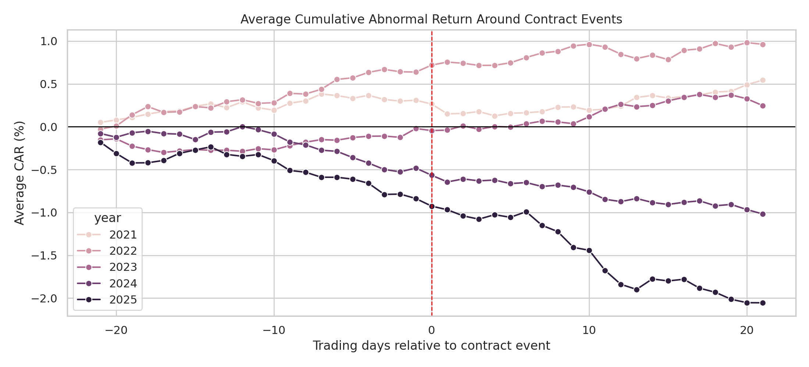
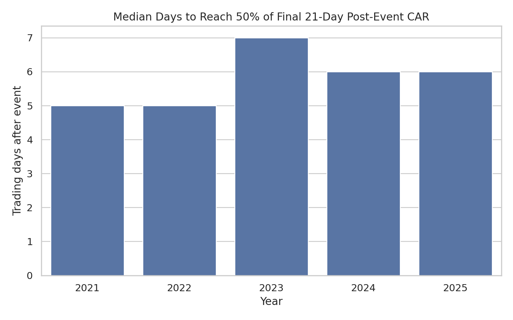

# Defense Contracts Event Study

An event-study analysis of US government contract awards and stock-market reaction for twelve publicly traded defense, aerospace, and federal-services companies. The project tests whether contract events recorded on USAspending.gov are followed by abnormal stock returns once sector exposure is properly controlled for — and documents the methodological correction of an earlier version that used the wrong benchmark.

**Author:** Tanush Reddy Chillakuru

---

## Overview

This repository contains two parallel analyses of the same research question, presented in chronological order to preserve the methodological story:

1. **SPY-benchmarked study (2024–2025)** — the original version, benchmarked against the broad-market S&P 500 ETF (SPY).
2. **ITA-benchmarked study (2021–2025)** — the corrected and extended version, benchmarked against the iShares U.S. Aerospace & Defense ETF (ITA), with events deduplicated at the contract-award level.

The two versions are kept side by side because the comparison between them is itself a finding: on the overlapping 2024–2025 sample, the 1-month average post-event abnormal return swings from **+2.19% under SPY** to **−1.16% under ITA** — a 3.35 percentage point reversal driven entirely by the benchmark change. This is a documented case study in how a sector-mismatched benchmark can manufacture a strong but spurious result in an event study.

---

## Research Questions

- Do publicly traded defense and federal-services companies earn abnormal returns after federal contract events?
- Are post-event returns different across 1-day, 1-week, and 1-month windows?
- How does the reaction vary across calendar years from 2021 to 2025?
- Does the cumulative abnormal return pattern suggest immediate or gradual market adjustment?
- How much of the apparent reaction in the original SPY-benchmarked version was driven by benchmark choice rather than by contract information?

---

## Key Findings

### Headline result (ITA-benchmarked, 2021–2025)

Once the sector-matched benchmark is applied and events are deduplicated at the award level, **the average post-event abnormal return is small and statistically indistinguishable from zero in the majority of year-window cells**. This is the result that financial theory would predict for a sample of large, heavily-followed contractors under semi-strong market efficiency: contract action dates recorded on USAspending typically do not coincide with the first public disclosure of the underlying news.

### Cells that survive scrutiny

| Year | Window | Avg AR | t-stat | Note |
|------|--------|--------|--------|------|
| 2021 | 1 trading day | −0.115% | −3.49 | Significant uncorrected; near Bonferroni threshold |
| 2025 | 1 trading month | **−1.162%** | **−4.82** | **Significant after Bonferroni correction** |

The 2025 one-month cell is the most notable single result and is the cell most worth investigating further with formal cross-sectional methods.

### The benchmark matters

The direct SPY-vs-ITA comparison on the overlapping 2024–2025 sample:

| Year | Window | SPY Avg | ITA Avg | Swing |
|------|--------|---------|---------|-------|
| 2024 | 1 month | −0.54% | −0.42% | +0.12 pp |
| 2025 | 1 day | +0.16% | −0.04% | −0.20 pp |
| 2025 | 1 week | +0.57% | −0.13% | −0.70 pp |
| 2025 | 1 month | **+2.19%** | **−1.16%** | **−3.35 pp** |

Most of the SPY-benchmarked 2025 result was sector beta, not contract-event reaction.

### Speed of price reflection

Across all five years (ITA-benchmarked), the median event reaches half of its 21-day post-event CAR within 5–7 trading days, and roughly a quarter is reflected by day 1. These figures are broadly stable year to year and are consistent with relatively prompt — though not instantaneous — market adjustment.

---

## Methodology

For each contract event, the workflow identifies the first available trading date on or after the contract action date, then calculates pre- and post-event stock returns over three windows: 1 trading day, 5 trading days (≈1 week), and 21 trading days (≈1 month).

**Abnormal return** is calculated as:

```
Abnormal return = Company stock return − Benchmark return
```

A relative-day event panel from day −21 to day +21 is constructed for each event, and cumulative abnormal return (CAR) is used to visualize the average path around contract dates. Summary tables report sample means, standard errors, t-statistics, 95% confidence intervals, medians, and the share of events with positive post-event abnormal returns. Significance is discussed under both the naive 5% threshold and a Bonferroni correction for 15 simultaneous tests.

**Event definition (ITA version):** Events are deduplicated by `(ticker, award_id)`, keeping the earliest action date per pair. This treats contract modifications, option exercises, and administrative re-postings as part of the original award rather than as separate news events.

---

## Watchlist

Twelve publicly traded companies are mapped to USAspending recipient search queries:

Lockheed Martin (LMT), RTX/Raytheon (RTX), Northrop Grumman (NOC), General Dynamics (GD), Boeing (BA), Huntington Ingalls (HII), L3Harris (LHX), Leidos (LDOS), Booz Allen Hamilton (BAH), Palantir (PLTR), Textron (TXT), Honeywell (HON).

---

## Data Sources

- **US government contracts:** [USAspending.gov](https://www.usaspending.gov/) public API, endpoint `/api/v2/search/spending_by_transaction/`, contract award type codes A, B, C, D.
- **Stock prices:** Yahoo Finance via the [`yfinance`](https://pypi.org/project/yfinance/) Python package; adjusted daily closing prices.
- **Benchmarks:** ITA (iShares U.S. Aerospace & Defense ETF) for the sector-matched study; SPY (SPDR S&P 500 ETF Trust) for the original broad-market version.

---

## Repository Structure

```
defense_contracts_event_study/
├── README.md
├── requirements.txt
├── .gitignore
│
├── analysis_ITA_benchmark/             # Corrected version (2021–2025)
│   ├── event_study_ITA_2021_2025.py    # Analysis script
│   ├── output/
│   │   ├── charts/                     # 7 figures (PNG)
│   │   └── data/                       # 10 output CSVs
│   └── report/
│       ├── Event_Study_Report_ITA_2021_2025.docx
│       └── Event_Study_Report_ITA_2021_2025.pdf
│
└── analysis_SPY_benchmark/             # Original version (2024–2025)
    ├── event_study_SPY_2024_2025.py
    ├── output/
    │   ├── charts/
    │   └── data/
    └── report/
        ├── Event_Study_Report_SPY_2024_2025.docx
        └── Event_Study_Report_SPY_2024_2025.pdf
```

---

## How to Run

### Requirements

Python 3.10+ and the following packages:

```bash
pip install pandas numpy matplotlib seaborn requests yfinance python-docx
```

Or with the included file:

```bash
pip install -r requirements.txt
```

### Running an analysis

Each analysis is a self-contained script that scrapes contract data, downloads market prices, computes event-window returns, builds summary tables, and writes charts and CSVs to its `output/` folder.

```bash
# Corrected sector-matched study (2021–2025, ITA benchmark)
python analysis_ITA_benchmark/event_study_ITA_2021_2025.py

# Original broad-market study (2024–2025, SPY benchmark)
python analysis_SPY_benchmark/event_study_SPY_2024_2025.py
```

The scripts were originally developed in Google Colab and are organized as cell-by-cell blocks; they run end-to-end as standard Python scripts as well. Expect ~5–15 minutes per script depending on network latency to USAspending and Yahoo Finance.

---

## Selected Figures

Average cumulative abnormal return around contract events (ITA-benchmarked, 2021–2025):



Median speed of price reflection by year:



---

## Limitations

The full discussion is in the ITA report. The headline caveats:

- **Anticipation effect.** Major DoD contract awards are typically announced through press releases on or shortly before the USAspending action date. The action date is often not the moment of first public disclosure, which attenuates any measurable post-action reaction.
- **Event clustering.** Each of twelve companies contributes hundreds of events; simple t-statistics treat these as independent and therefore understate the true standard error. A cluster-robust or firm-fixed-effects specification would tighten inference.
- **Sector-control imperfection.** ITA contains the watchlist names in its own holdings, which biases the abnormal-return estimate slightly toward zero. A peer-excluded sector proxy would be a cleaner control.
- **Selection effects.** The watchlist is a curated set of major contractors, not a random sample of US public companies receiving federal awards.
- **Recipient-string matching.** USAspending recipient search text can match subsidiaries or related entities; strict legal-entity mapping was not performed.
- **Exploratory, not causal.** The study measures market behavior around contract dates; it does not establish that the contract caused the observed return, and it is not investment advice.

---

## Reports

The full write-ups, with all tables, figures, and methodological discussion, are in each analysis's `report/` folder. The ITA report is the primary deliverable; the SPY report is preserved as the original version against which the corrected analysis is compared.
